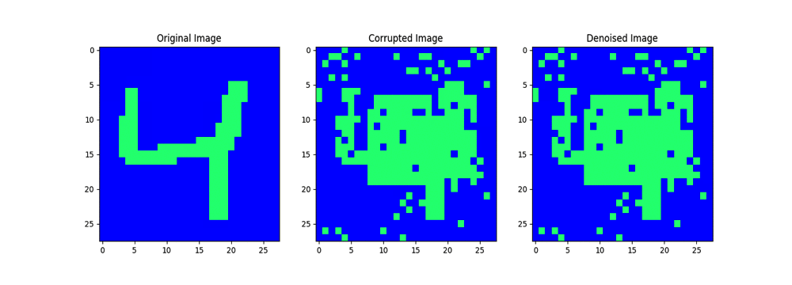

# hopfield-nets

Hopfield Nets were one of the first success stories of the Connectionists, and they operate on a somewhat different pronciple than the DNNs that are so popular today. In essense, Hopfield networks are a specific class of Connectionist _energy_  based neural networks, whereby relationships between neurons/pixels are impressed into the weights as minimum energy states. 

This allows us to store patterns and later recover them from their corrupted versions - the so called, "content addressable networks", which are somewhat akin to how we are so easily able to recall memories by only being given certain cues. 

The above animation shows a hopfield network at work, completely recovering a corrupted pattern. 

This repo will walk you through the process of building a Hopfield network. To do so, simply run hopfield.ipynb via:

`ipython notebook hopfield.ipynb`
